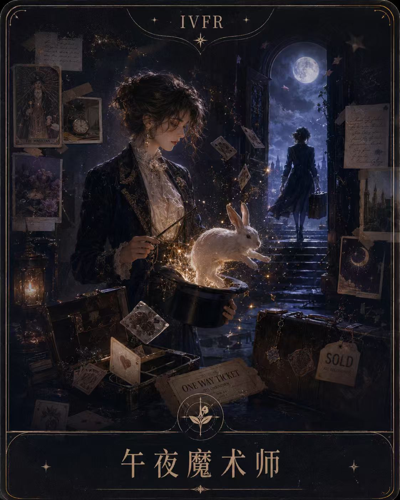

<div align="center">
  <h1>REST Restart Indicator</h1>
  <p><b>一个带梦幻游戏感的第二人生人格测试。</b></p>
  <p>
    <a href="https://siia-deng.github.io/bind_box/experience/rest-restart/"></a>
    <a href="https://github.com/siia-deng/bind_box"></a>
    
    
  </p>
</div>

## Why

REST 重启人格指标不是严肃心理测评，而是一个给人“重新开始”灵感的互动小游戏。它借用了 MBTI / SBTI 这类四维度类型系统的轻量结构，把用户的选择转译成一组第二人生建议：你适合安静修复，还是公开告别；你需要十年蓝图，还是一次深夜出走。

测试的目标不是给人贴标签，而是在结果页给出一个可想象、可行动、可分享的重启剧本。用户完成 12 个生活节点后，会得到一个 REST 代码、一个原型人格、一张 Dream Board 配图，以及一组人格阐述和职业化建议。

## See it

线上体验：[REST 重启人格测试](https://siia-deng.github.io/bind_box/experience/rest-restart/)

<table>
<tr>
  <td align="center" width="25%">
    
    <br><b>IAPS</b> · 温柔的考古学家
    <br><sub>独处、复盘、慢慢重建地基</sub>
  </td>
  <td align="center" width="25%">
    
    <br><b>IVFR</b> · 午夜魔术师
    <br><sub>愿景、直觉、瞬间切换身份</sub>
  </td>
  <td align="center" width="25%">
    
    <br><b>EAPS</b> · 篝火旁的讲述者
    <br><sub>在人群和故事里与过去和解</sub>
  </td>
  <td align="center" width="25%">
    
    <br><b>EVFR</b> · 闪灵舞台
    <br><sub>在被看见的时刻完成重启</sub>
  </td>
</tr>
</table>

## Usage

安装依赖：

```bash
npm install
```

只启动前端：

```bash
npm run dev -w web
```

打开：

```text
http://localhost:3000/experience/rest-restart
```

完整启动前后端：

```bash
npm run dev
```

默认地址：

| App | URL |
|---|---|
| Web | `http://localhost:3000` |
| API | `http://localhost:4000/api/health` |

## REST System

REST 是 `Restart Energy & Self-Transformation Indicator` 的缩写，由四个维度组合出 16 种人格类型：

| 维度 | 代码 | 含义 |
|---|---|---|
| 能量重启模式 | `I / E` | 内倾重启 / 外倾重启 |
| 锚点方向 | `A / V` | 接纳过去 / 愿景未来 |
| 蜕变策略 | `P / F` | 计划型 / 流动型 |
| 行动节奏 | `S / R` | 渐进 / 快速 |

16 种结果包括：

| Code | 原型 | Code | 原型 |
|---|---|---|---|
| `IAPS` | 温柔的考古学家 | `IAPR` | 灼烧的凤凰 |
| `IAFS` | 溪流般的疗愈师 | `IAFR` | 深夜的闪电 |
| `IVPS` | 阁楼里的蓝图 | `IVPR` | 孤独的发射者 |
| `IVFS` | 梦游的画家 | `IVFR` | 午夜魔术师 |
| `EAPS` | 篝火旁的讲述者 | `EAPR` | 街头革命家 |
| `EAFS` | 流浪歌者 | `EAFR` | 即兴火焰 |
| `EVPS` | 城市建造师 | `EVPR` | 烟花引爆者 |
| `EVFS` | 风中的信使 | `EVFR` | 闪灵舞台 |

## Design

整体体验希望像一场“重启人生”的轻量游戏，而不是一份表格问卷。

| Element | Rule |
|---|---|
| 流程 | 12 个生活节点，逐步采集倾向，不一次性暴露所有题目 |
| 视觉 | 梦幻、夜色、发光轨迹、Dream Board 拼贴感 |
| 结果 | REST 代码、人格原型、对应配图、人格解析和职业建议一起出现 |
| 交互 | 支持前后节点切换、进度反馈、结果弹窗解析 |
| 分享 | 结果页天然适合截图传播，标题和人格标签保持清晰 |

## Structure

```text
.
├── web/
│   ├── app/
│   │   └── experience/rest-restart/
│   │       ├── page.tsx
│   │       ├── RestRestartApp.tsx
│   │       └── rest-restart.css
│   └── public/
│       └── rest-restart/personas/
│           ├── IAPS.jpg
│           ├── IAPR.jpg
│           └── ...
├── service/
│   └── Node.js + Express API
└── package.json
```

## Deploy

项目已配置 GitHub Pages 静态导出。生产构建时需要写入 GitHub Pages 的 base path：

```bash
GITHUB_PAGES=true NEXT_PUBLIC_BASE_PATH=/bind_box npm run build -w web
```

静态产物会生成到：

```text
web/out
```

当前公开访问地址：

```text
https://siia-deng.github.io/bind_box/experience/rest-restart/
```

## Background

这个项目从一个“类似 MBTI / SBTI 的小游戏人格测试”开始：先定义 REST 四维度和 16 种类型，再把结果页做成 Dream Board 式的第二人生建议。后续加入了每种人格的专属配图、弹出式解析模块和职业建议，让测试不只是算出一个代码，而是给用户一个可进入、可讨论、可延展的自我叙事。

## License

This project has no public license specified yet.
